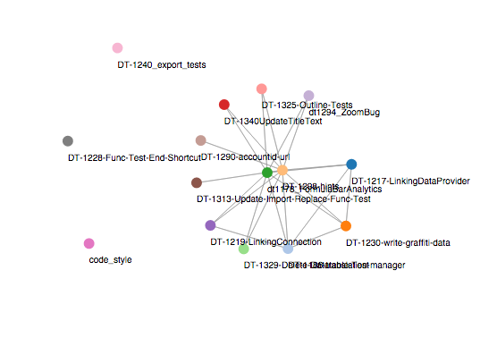

# merge conflict detector

usage: 

```
dart ./bin/detector.dart [github username] [github repo name] [path/to/local/copy]
```

outputs a list of success and failures:

```
SUCCESS username/branchname => username/branchname
FAILURE username/branchname => username/branchname
```

and a JSON adjency list:
```
{
    "branchname": ["branchname", "branchname"],
}
```

replacing web/graph.json with the adjency list will render the graph using d3:

```
pub serve
# open localhost:8080
```


